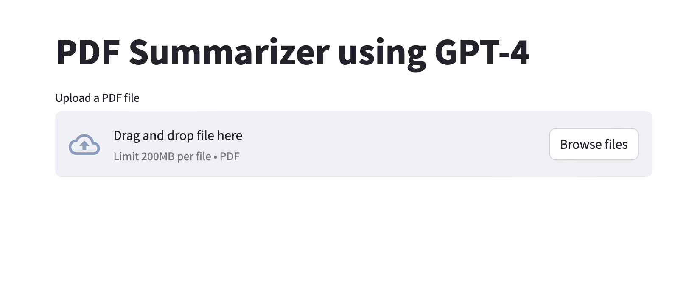

## Summarize PDFs with GPT-4 
A webapp built around GPT-4 model to summarize PDFs. 

The frontend is built with [Streamlit](https://github.com/streamlit/streamlit). Checkout their amazing project! 



## Start the app server 
```
python -m streamlit run pdf_summarizer.py
```

## Setup 
- Follow the [Prerequisites](https://learn.microsoft.com/en-us/azure/cognitive-services/openai/quickstart?tabs=command-line&pivots=programming-language-studio#prerequisites)
from Microsoft to setup Azure OpenAI resource. 
- Update the .env file with your keys 