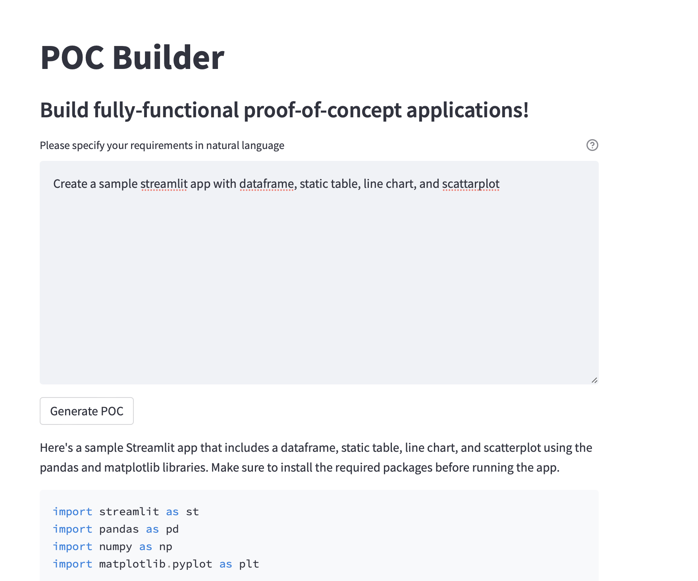

# No-Code POC Builder
This is an experimental tool that allows users to effortlessly create functional applications using natural language instructions. 

The app provides a simple natural language interface built using Streamlit to allow users to describe application's requirements. Key idea is to enable Rapid Prototyping for practically any use-case. There can however be limitations when dealing with complex use-cases.

## Specify requirements

## Generated application 
See [Sample Output PDF](data/sample_output.pdf)

Sample image of a scatterplot from the generated application

## Known issues 
- Sometimes the LLM may generate code that cannot be directly launched. Minimal user insight may be required here to start the Streamlit server. 
- Generated code can include libraries that may not present in the virtual environment. 
