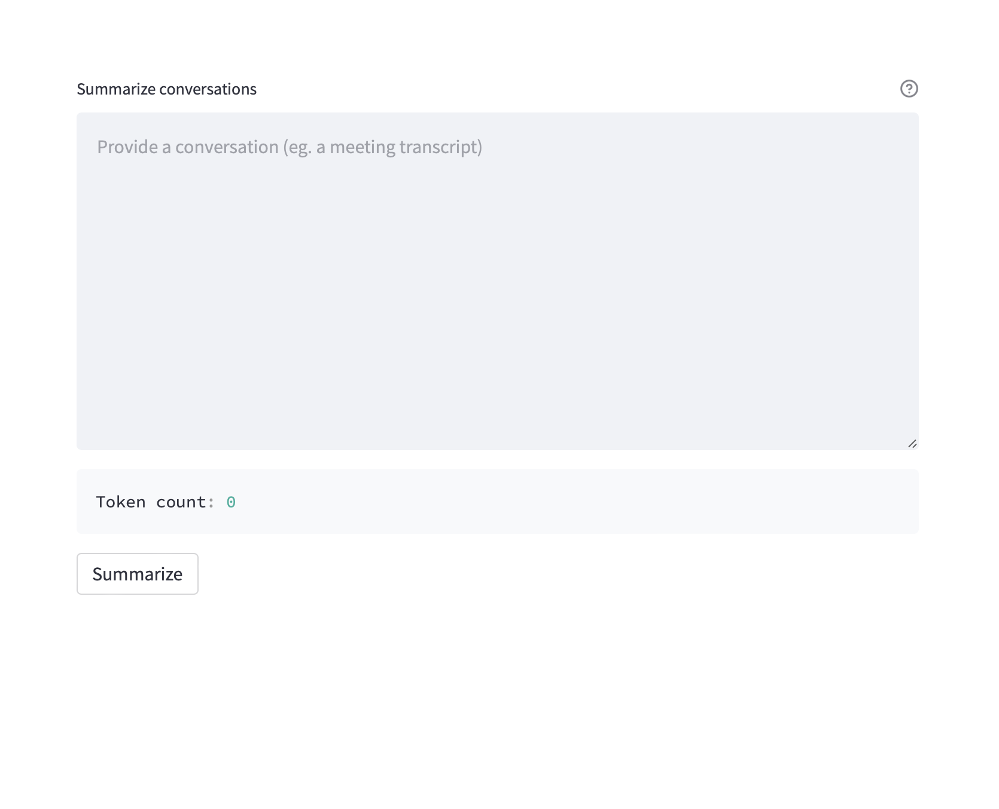

## Summarize Conversations with GPT3/ChatGPT 
A simple webapp built around GPT3 and ChatGPT models to summarize conversations such as business meetings, interviews, presentations, and more.  

The frontend is built with [Streamlit](https://github.com/streamlit/streamlit). Checkout their amazing project! 



## Start the app server 
```
python -m streamlit run main.py 
```

## Setup 
- Follow the [Prerequisites](https://learn.microsoft.com/en-us/azure/cognitive-services/openai/quickstart?tabs=command-line&pivots=programming-language-studio#prerequisites)
from Microsoft to setup Azure OpenAI resource. 
- Update the .env file with your keys 