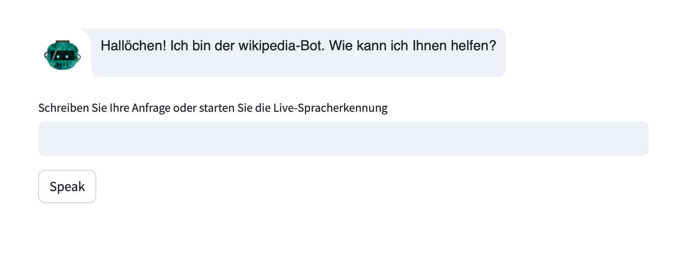

# Wikipedia AI Interface

## Setup 
Create a virtual environment and install the packages using pip.
````
python -m venv venv
source myvenv/bin/activate (Activate venv on Unix-based machines)
venv\Scripts\activate.bat (Activate venv on Windows-based machine - cmd)
pip install -r requirements.txt
````
This app uses OpenAI Studio from MS Azure. 
Add the Open AI API_KEY to `.env/` file. You can find this in Open AI Studio, if you have access to Azure and OpenAI resource group. 

Additionally you need to add API keys for Wikipedia and You.com APIs. 

The first time you click the button for live speech recognition, it'll download the speech-to-text model. This may take some time. 

## Start the WebApp 
Start the Streamlit server to communicate with the AI assistant. 
```
python -m streamlit run wiki_interface.py
```
This will start a local server. 

## Talking to the AI-assistant 
Converse in natural language using text or press the "Speak" button to provide voice-based input. 
If you use the live transcription functionality, the transcriptions may contain spelling mistakes. 
However, this should not affect the response from the assistant. 




## Development configuration
The following was the configuration of the system this POC was developed on. 
If something goes wrong with a package, see if changing the python or pip version helps. 

- python version 3.8.10 
- pip version 21.3.1 
- OS: Windows